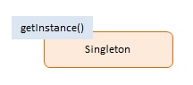

# JavaScript Singleton (Một lớp mà chỉ có một thể hiện duy nhất có thể tồn tại)

> Singleton pattern giới hạn số lượng **phiên bản** của một đối tượng cụ thể chỉ là một.

## 1. Using Singleton

- Mục tiêu của Singleton pattern là đảm bảo rằng một lớp chỉ có một thể hiện (đối tượng) duy nhất và cung cấp một điểm truy cập toàn cục đến thể hiện này.
  + Singleton làm giảm nhu cầu về các biến toàn cục, điều này đặc biệt quan trọng trong JavaScript vì nó hạn chế ô nhiễm không gian tên và nguy cơ xung đột tên liên quan.
  + Một số mẫu khác, chẳng hạn như `Factory`, `Prototype` và `Façade` thường được triển khai dưới dạng Singleton khi chỉ cần một phiên bản.

## 2. Implementation Ways

### Cách 1: ES5 (IIFE & Closure) - [dofactory.js](./dofactory.js)

Đây là cách cổ điển trước khi có ES6 Class. Sử dụng **Revealing Module Pattern** để ẩn biến `instance`.

```js
const Singleton = (function () {
  let instance;

  function createInstance() {
    const object = new Object("I am the instance");
    return object;
  }

  return {
    getInstance: function () {
      if (!instance) {
        instance = createInstance();
      }
      return instance;
    },
  };
})();
```

### Cách 2: ES6 Class & Static Property - [es6-class.js](./es6-class.js)

Cách hiện đại hơn, tường minh hơn sử dụng class.

```js
class Singleton {
  constructor() {
    if (Singleton.instance) {
      return Singleton.instance;
    }
    // Khởi tạo
    Singleton.instance = this;
  }
}
```

## 3. Khi nào dùng & Khi nào tránh

### ✅ Khi nào dùng (Use Cases)
- **Quản lý trạng thái toàn cục (Global State):** Redux Store, Vuex Store.
- **Dịch vụ dùng chung (Shared Services):** Database Connection, Logger, Config Manager.
- **Caching:** Cache dữ liệu để không phải load lại nhiều lần.

### ❌ Nhược điểm (Cons)
- **Khó test (Unit Testing):** Vì global state được chia sẻ, test A có thể làm bẩn dữ liệu của test B.
- **Ẩn giấu sự phụ thuộc (Hidden Dependencies):** Một hàm gọi `Singleton.getInstance()` bên trong nó sẽ không thể hiện rõ dependency đó ra bên ngoài (qua tham số), làm code khó đọc và khó hiểu luồng chạy.

## 4. Diagram


