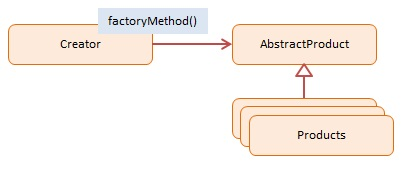

# JavaScript Factory Method (Tạo một thể hiện của nhiều lớp)

> Nhiệm vụ chính của `Factory Method` là tạo ra đối tượng mà không phải chỉ định cụ thể lớp (class) của đối tượng đó.

## 1. Using Factory Method

- Mục tiêu chính của `Factory Method` là khả năng mở rộng.
- `Factory Method` cho phép bạn tạo ra đối tượng **một cách động** dựa trên các điều kiện, ngữ cảnh hoặc thông tin khác mà bạn có.
- Thay vì việc khởi tạo đối tượng bằng cách sử dụng trực tiếp từ khóa **"new"** để tạo một thể hiện của lớp cụ thể, bạn tạo ra một phương thức (gọi là Factory Method) trong một interface hoặc lớp cơ sở. Các lớp con sẽ triển khai Factory Method này để tạo ra các đối tượng cụ thể.

## 2. Implementation Ways

### Cách 1: ES5 (Function Constructor) - [dofactory.js](./dofactory.js)

Cách cổ điển sử dụng function constructor để định nghĩa "class" và method.

```js
const Factory = function () {
  this.createEmployee = function (type) {
    let employee;
    if (type === "fulltime") {
      employee = new FullTime();
    } 
    // ...
    return employee;
  };
};
```

### Cách 2: ES6 Class - [es6-class.js](./es6-class.js)

Cách hiện đại sử dụng `class` và `extends` để quản lý kế thừa rõ ràng hơn.

```js
class EmployeeFactory {
  createEmployee(type, name) {
    switch (type) {
      case "fulltime":
        return new FullTime(name);
      // ...
    }
  }
}
```

## 3. Khi nào dùng & Khi nào tránh

### ✅ Advantages (Ưu điểm)
- **Decoupling (Giảm sự phụ thuộc):** Client code không cần biết về các lớp cụ thể (ConcreteProduct), chỉ cần làm việc với Factory và Interface chung.
- **Single Responsibility Principle:** Code tạo object tập trung ở một nơi, dễ bảo trì.
- **Open/Closed Principle:** Dễ dàng thêm loại sản phẩm mới mà không cần sửa code cũ của client.

### ❌ Disadvantages (Nhược điểm)
- **Complexity:** Code có thể trở nên phức tạp hơn vì phải tạo thêm nhiều subclass con.

## 4. Diagram

;

## 5. Participants

**Creator** (`Factory`)
- Đối tượng 'factory' tạo ra sản phẩm mới.
- Cài đặt 'factoryMethod' trả về sản phẩm mới được tạo.

**ConcreteProduct** (`FullTime`, `PartTime`...)
- Sản phẩm cụ thể được tạo ra.
- Tất cả sản phẩm hỗ trợ cùng một interface (thuộc tính và phương thức).
