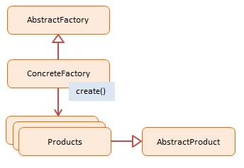

# JavaScript Abstract Factory (Tạo một thể hiện của một số họ đối tượng liên quan)

> Mục tiêu chính của `Abstract Factory` pattern là cung cấp một giao diện (interface) để tạo ra các họ đối tượng liên quan hoặc các đối tượng có liên quan mà không cần chỉ định lớp cụ thể của chúng.

## 1. Using Abstract Factory

- `Abstract Factory` pattern cho phép bạn tạo ra các hệ thống đối tượng có tính tương thích, bằng cách đảm bảo rằng các đối tượng được tạo ra từ cùng một `Abstract Factory` sẽ tương thích với nhau.
- Nó cung cấp một cách để đóng gói việc tạo đối tượng và giúp tránh sự phụ thuộc vào các lớp cụ thể của đối tượng.

> Khi sử dụng `Abstract Factory` pattern, bạn không cần phải biết cụ thể về cách tạo từng đối tượng UI trong client code. Thay vào đó, bạn sử dụng phương thức được cung cấp bởi `Abstract Factory` để tạo ra các đối tượng mà bạn cần, và cách chúng được tạo ra là trách nhiệm của các Concrete Factory.


> "Tương thích" (Compatible) trong Abstract Factory có nghĩa là các đối tượng được tạo ra phải **thuộc cùng một "họ" (family) hoặc cùng một chủ đề (theme)** để đảm bảo tính đồng bộ khi ứng dụng chạy.

### Ví dụ minh họa: Nội thất (Furniture)

Hãy tưởng tượng bạn có 2 phong cách nội thất:
- **Hiện đại (Modern):** Ghế Hiện đại, Bàn Hiện đại, Sofa Hiện đại.
- **Cổ điển (Victorian):** Ghế Cổ điển, Bàn Cổ điển, Sofa Cổ điển.

**1. Thế nào là "Tương thích"?**
Khi bạn trang trí một căn phòng, nếu bạn chọn phong cách **Hiện đại**, bạn phải dùng trọn bộ: Ghế, Bàn, Sofa đều phải là **Hiện đại**.
=> Chúng **tương thích** với nhau vì cùng style, nhìn căn phòng đẹp và hợp lý.

**2. Thế nào là "KHÔNG tương thích"?**
Nếu bạn để cái **Ghế Hiện đại** cạnh cái **Bàn Cổ điển**, nó sẽ bị lệch tông, nhìn rất xấu và không đồng bộ.
=> Đây là sự **không tương thích**.

**3. Abstract Factory giải quyết gì?**

Nếu bạn tự code `new ModernChair()` rồi dòng sau lỡ tay `new VictorianTable()`, code vẫn chạy nhưng giao diện (UI) sẽ bị "lổn nhổn".

Abstract Factory tạo ra một "người quản lý" (Factory).
- Nếu bạn gọi `ModernFactory`: Ông này **cam kết** chỉ đưa cho bạn đồ Hiện đại. Dù bạn xin Ghế hay Bàn, ổng đều đưa đúng loại Hiện đại.
- Bạn **không thể** tạo nhầm đồ Cổ điển khi đang dùng `ModernFactory`.


## 2. Implementation Ways

### Cách 1: ES5 (Function Constructor) - [dofactory.js](./dofactory.js)

Sử dụng function constructor để tạo các "class" giả lập.

```js
function EmployeeFactory() {
    this.create = function (name) {
        return new Employee(name);
    };
}
```

### Cách 2: ES6 Class & Inheritance - [es6-class.js](./es6-class.js)

Sử dụng `class` và `extends` để tạo cấu trúc Factory rõ ràng hơn. Ví dụ về UI Kit (Windows/MacOS) thường xuyên được dùng để minh họa pattern này.

```js
// Abstract Factory
class GUIFactory {
  createButton() { /* abstract */ }
  createCheckbox() { /* abstract */ }
}

// Concrete Factory
class WindowsFactory extends GUIFactory {
  createButton() { return new WindowsButton(); }
  createCheckbox() { return new WindowsCheckbox(); }
}
```

## 3. Khi nào dùng & Khi nào tránh

### ✅ Advantages (Ưu điểm)
- **Tính nhất quán (Consistency):** Đảm bảo các sản phẩm tạo ra từ một factory luôn tương thích với nhau (ví dụ: Button Win đi với Checkbox Win).
- **Tách biệt (Decoupling):** Code client không phụ thuộc vào lớp cụ thể.
- **Dễ dàng tráo đổi (Easy Swapping):** Chỉ cần đổi Factory khởi tạo ban đầu, toàn bộ hành vi tạo object của ứng dụng sẽ thay đổi theo.

### ❌ Disadvantages (Nhược điểm)
- **Phức tạp (Complexity):** Cần tạo nhiều file, nhiều class interface.
- **Khó mở rộng sản phẩm mới:** Nếu `AbstractFactory` thêm một method `createTable()`, tất cả các Concrete Factory đều phải implement lại.

## 4. Diagram

;

## 5. Participants

**AbstractFactory** (`GUIFactory`)
- Khai báo interface cho các operations tạo ra abstract product.

**ConcreteFactory** (`WindowsFactory`, `MacOSFactory`)
- Thực thi các operations để tạo ra concrete product tương ứng.

**AbstractProduct** (`Button`, `Checkbox`)
- Khai báo interface cho một loại product object.

**Product** (`WindowsButton`, `MacOSButton`)
- Định nghĩa product cụ thể, implement Interface AbstractProduct.
