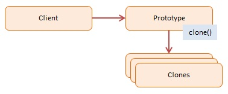

# JavaScript Prototype (Tạo bản sao từ một mẫu có sẵn)

> **Prototype Pattern** tạo ra các objects mới bằng cách sao chép (copy/clone) từ một object mẫu (prototype) thay vì tạo từ class thông qua `new`.

## 1. Using Prototype

- Mục tiêu của Prototype pattern là giảm chi phí khởi tạo đối tượng. Nếu việc khởi tạo một đối tượng mới tốn nhiều tài nguyên (ví dụ: kết nối DB, tính toán phức tạp), việc **clone** một object đã có sẽ hiệu quả hơn nhiều.
- JavaScript bản chất là một ngôn ngữ **Prototype-based**. Mọi object trong JS đều có một link ẩn đến một object khác gọi là "prototype".

### Khi nào dùng? (When to use)
- Khi việc tạo mới object quá "đắt đỏ" (expensive) về hiệu năng.
- Khi muốn tránh subclassing quá nhiều (tạo quá nhiều lớp con).
- Khi các object chỉ khác nhau ở một vài trạng thái nhỏ (state), còn lại cấu trúc giống hệt nhau.

## 2. Implementation Ways

### Cách 1: ES5 (Manual Cloning) - [dofactory.js](./dofactory.js)

Tự xây dựng hàm `clone` để copy các thuộc tính sang object mới.

```js
function CustomerPrototype(proto) {
  this.proto = proto;
  this.clone = function () {
    var customer = new Customer();
    customer.first = proto.first; // Copy manual
    // ...
    return customer;
  };
}
```

### Cách 2: ES6 Class & Object.create - [es6-class.js](./es6-class.js)

Sử dụng `Object.create()` hoặc phương thức `clone` trong Class.

```js
// Cách dùng Object.create (Prototypal Inheritance)
const carPrototype = {
  wheels: 4,
  start() { console.log("Vroom!"); }
};
const myCar = Object.create(carPrototype);

// Cách dùng Class clone
class Component {
  clone() {
    // Clone nông (Shallow copy)
    return Object.assign(Object.create(Object.getPrototypeOf(this)), this);
  }
}
```

## 3. Pros & Cons

### ✅ Advantages (Ưu điểm)
- **Hiệu năng:** Clone object thường nhanh hơn `new` nếu constructor làm nhiều việc nặng.
- **Linh hoạt:** Có thể thêm/bớt thuộc tính của object ngay lúc runtime.

### ❌ Disadvantages (Nhược điểm)
- **Deep Clone:** Việc clone đệ quy (deep clone) các object phức tạp (có chứa object con, mảng, vòng lặp tham chiếu) rất khó và dễ gây lỗi.
- **Constructor không chạy:** Khi dùng `Object.create`, constructor của class sẽ không được chạy lại, có thể gây thiếu sót thiết lập ban đầu nếu không cẩn thận.

## 4. Diagram

;
