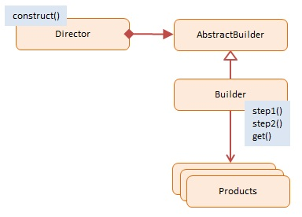

# JavaScript Builder (Tách biệt việc xây dựng đối tượng)

> **Builder Pattern** cho phép xây dựng các object phức tạp từng bước một. Pattern này giúp bạn tạo ra các hình thái khác nhau của một object bằng cách sử dụng cùng một quy trình xây dựng.

## 1. Using Builder

- **Giải quyết vấn đề "Constructor Telescoping":** Khi một class có quá nhiều tham số trong constructor (10 tham số, 5 cái optional), việc gọi `new Class(a, b, null, null, c)` rất dễ gây lỗi và khó đọc.
- **Tách biệt logic khởi tạo:** Giúp class chính (Product) không bị "phình to" bởi logic khởi tạo phức tạp.

### Khi nào dùng? (When to use)
- Khi constructor của object có quá nhiều tham số (hơn 3-4 tham số).
- Khi bạn muốn tạo ra các biến thể khác nhau của object (ví dụ: Pizza đế dày, Pizza đế mỏng, Pizza hải sản...).

## 2. Implementation Ways

### Cách 1: ES5 (Classic Gang of Four) - [dofactory.js](./dofactory.js)

Sử dụng **Director** để điều phối quy trình xây dựng và các **ConcreteBuilder** để thực hiện từng bước.

```js
// Director chỉ đạo xây dựng
shop.construct(carBuilder);
// Builder thực hiện
this.step1 = function() { ... };
this.step2 = function() { ... };
```

### Cách 2: ES6 Modern (Method Chaining / Fluent Interface) - [es6-class.js](./es6-class.js)

Đây là cách phổ biến nhất trong JS/TS hiện đại. Không cần Director, Client code tự gọi các method `set...` nối đuôi nhau.

```js
const myCar = new CarBuilder()
  .setBrand("Tesla")
  .setModel("Model S")
  .setColor("Red")
  .setSunroof(true)
  .build(); // Trả về object Car hoàn chỉnh
```

## 3. Pros & Cons

### ✅ Advantages (Ưu điểm)
- **Code sạch (Clean Code):** Tránh được constructor khổng lồ với hàng tá tham số `null`.
- **Dễ đọc (Readable):** Method chaining giống như ngôn ngữ tự nhiên (`setBrand`, `setModel`...).
- **Immutability:** Có thể thiết kế để object sau khi `build()` là bất biến (immutable).

### ❌ Disadvantages (Nhược điểm)
- **Duplicate Code:** Phải copy các thuộc tính từ Product sang Builder.
- **Complexity:** Tăng số lượng class (cần thêm class Builder cho mỗi Product).

## 4. Diagram

;
