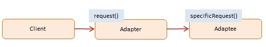

# JavaScript Adapter Pattern

> Mục tiêu chính của Adapter pattern là tạo ra một lớp trung gian (adapter) để làm cho các đối tượng **không tương thích** với nhau có thể làm việc cùng nhau.

The **Adapter pattern** "dịch" một interface (method/property) này sang một interface khác. Nó giống như **cục sạc chuyển đổi đầu cắm điện** (ví dụ từ chấu 3 chân sang chấu 2 chân) – bạn không thể cắm trực tiếp, nhưng thông qua Adapter, mọi thứ hoạt động trơn tru. `Adapter pattern` còn được gọi là `Wrapper pattern`.

## 1. Using Adapter (Khi nào dùng)

- Khi tích hợp thư viện của bên thứ 3 (Thư viện dùng tên hàm khác với code hiện tại của bạn).
- Khi nâng cấp hệ thống cũ (Legacy system): Hệ thống mới có API mới, nhưng bạn không muốn (hoặc không thể) sửa hàng ngàn dòng code ở phía Client đang gọi API cũ. => Dùng Adapter bọc API mới lại nhưng giữ nguyên tên hàm của API cũ.

## 2. Implementation Ways

### Cách 1: ES5 (Sử dụng Function) - [dofactory.js](./dofactory.js)

Ví dụ về hệ thống tính phí vận chuyển cũ (`Shipping`) được Adapter thành hệ thống mới (`AdvancedShipping`) nhưng Client vẫn gọi hàm `request()` như cũ.

### Cách 2: ES6 Class - [es6-class.js](./es6-class.js)

Sử dụng Class để mô phỏng một `OldCalculator` (có method `operations()`) và một `NewCalculator` (có method `add()`, `sub()`). `CalculatorAdapter` ánh xạ từ `operations()` sang các hàm cụ thể của hệ thống mới.

```javascript
class CalculatorAdapter {
  constructor() {
    const newCalc = new NewCalculator();
    this.operations = function(term1, term2, operation) {
      if (operation === 'add') return newCalc.add(term1, term2);
      // ... mapping
    };
  }
}
```

## 3. Pros & Cons

### ✅ Advantages (Ưu điểm)
- **Single Responsibility Principle (Nguyên lý Đơn trách nhiệm):** Bạn có thể tách biệt logic chuyển đổi dữ liệu/interface ra khỏi logic kinh doanh cốt lõi của ứng dụng.
- **Open/Closed Principle (Nguyên lý Đóng/Mở):** Bạn có thể đưa một kiểu Adapter mới vào chương trình mà không làm hỏng logic client hiện tại. Điều này vô cùng hiệu quả khi code gốc bị thiết kế cứng không thể sửa chữa.

### ❌ Disadvantages (Nhược điểm)
- **Độ phức tạp tăng lên:** Tổng độ phức tạp của code source tăng lên do phải tạo thêm nhiều class, object mới (Adapter). Đôi khi việc thay đổi trực tiếp service class lại đơn giản hơn là viết một Adapter nếu có thể.

## 4. Diagram



## 5. Participants

**Client** (`run()`, `Client code`)
- Gọi đến Adapter để sử dụng service thông qua một interface quen thuộc.

**Target/Adapter Interface** (`ShippingAdapter`, `CalculatorAdapter`)
- Cung cấp interface tương thích mà Client mong đợi, nhưng bên trong nó ngầm gọi đến Adaptee.

**Adaptee** (`AdvancedShipping`, `NewCalculator`)
- Nhóm đối tượng chứa các xử lý nghiệp vụ hữu ích hoặc API của bên thứ 3, nhưng interface lại khác biệt và không tương thích với Client hiện tại.
