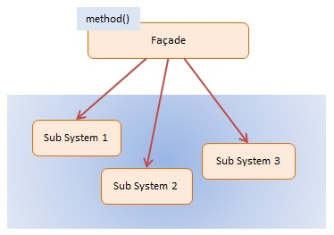

# JavaScript Façade Pattern

> **Façade Pattern** (Mặt tiền) đóng vai trò như một giao diện duy nhất, cung cấp lối tiếp cận đơn giản để che giấu đi sự phức tạp của một hoặc nhiều hệ thống con (Subsystems) bên dưới bên dưới.

- Nó cung cấp một cái nhìn đơn giản (simple view) cho Client thay vì phải tương tác với hàng chục class/hàm lằng nhằng.
- Rất phổ biến trong kiến trúc phần mềm, đặc biệt là khi làm việc với API hoăc các thư viện phức tạp.

## 1. Using Façade

- **Che giấu độ phức tạp**: Rút gọn các thao tác lặp đi lặp lại hoặc các luồng quy trình nghiệp vụ cần gọi qua nhiều bước khác nhau.
- **Giảm sự phụ thuộc (Coupling)**: Client chỉ biết đến Facade class chứ không cần quan tâm Subsystem nào đang chạy. Nhờ vậy nếu Subsystem thay đổi (ví dụ thay đổi thư viện mã hoá hay đổi hệ cở sở dữ liệu), Client không bị ảnh hưởng.

### Khi nào dùng? (When to use)
- Khi bạn cần tạo một "lối vào" (entry point) đơn giản để làm việc với một hệ thống khổng lồ và phức tạp.
- Khi muốn tổ chức lại hệ thống thành các layer (tầng). Facade sẽ là "cánh cửa" giao tiếp giữa các layer.

## 2. Implementation Ways

### Cách 1: ES5 / Simplified Class - [dofactory.js](./dofactory.js)

Một ví dụ phổ biến trên thương mại điện tử: Tính toán tổng giá tiền sau khi áp mã giảm giá `Discount`, cộng thêm `Fees` thuế, và `Shipping` phí vận chuyển. Thay vì client gọi 3 hàm độc lập, `ShopPattern` làm nhiệm vụ đó.

### Cách 2: ES6 Modern Class - [es6-class.js](./es6-class.js)

Một ví dụ kinh điển về Duyệt Khoản Vay Thế Chấp (Mortgage). Khách hàng (Client) đến quầy nhờ vay tiền. Nhân viên (Facade) sẽ đứng ra làm các nghiệp vụ:
- Hỏi Ngân Hàng (`Bank`) kiểm tra số dư.
- Hỏi Tín Dụng (`Credit`) kiểm tra lịch sử nợ xấu.
- Hỏi Hồ sơ lý lịch (`Background`) xem có tiền án không.
-> Khách hàng chỉ cần gọi hàm `applyFor(amount)` qua Facade và đợi kết quả, không cần tự tay đi 3 phòng ban trên.

## 3. Pros & Cons

### ✅ Advantages (Ưu điểm)
- **Dễ sử dụng (Easy to Use)**: Đơn giản hóa giao diện của các thư viện/framework lớn.
- **Tách biệt code (Decoupling)**: Cô lập mã logic kinh doanh của ứng dụng khỏi sự phức tạp của dịch vụ subsystem.

### ❌ Disadvantages (Nhược điểm)
- **God Object**: Nếu không cẩn thận và lạm dụng, Facade có thể biến thành một lớp `God Object` (Lớp thần thánh, ôm đồm mọi chức năng) khiến nó lớn đến mức không thể quản lý được và vi phạm nguyên tắc "Single Responsibility".

## 4. Diagram

## 5. Participants

**Façade** (`MortgageFacade`, `ShopPattern`)
- Đứng ra nhận yêu cầu từ Client và chuyển hướng yêu cầu tới các hệ thống con bên dưới xử lý.
- Biết chính xác hệ thống con nào chịu trách nhiệm cho việc gì.

**Sub Systems** (`Bank`, `Credit`, `Background`, `Discount`...)
- Cung cấp các chức năng chuyên biệt.
- Không biết hoặc không có tham chiếu ngược lại với `Façade`.