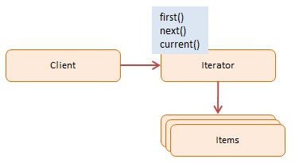

# JavaScript Iterator Pattern

> **Iterator Pattern** cung cấp một cách tiêu chuẩn (nhất quán) để truy xuất (lặp qua) tuần tự các phần tử của một tập hợp đối tượng (danh sách, cây, đồ thị...) mà không để lộ thiết kế hay cấu trúc bên trong của tập hợp đó.

Iterator pattern giúp việc tách thuật toán duyệt phân tách khỏi cấu trúc dữ liệu vùng chứa.

## 1. Using Iterator (Khi nào dùng)
- **Khi tập hợp phức tạp**: Nếu bạn có cấu trúc dữ liệu phức tạp (như Tree, Graph, Custom Object chứa nhiều mảng con), bạn không muốn code "duyệt qua nó" bị phơi bày khắp mọi nơi dưới dạng mớ lệnh rối rắm.
- **Tính đa hình**: Bạn muốn dùng **một vòng lặp y hệt nhau** cho các kiểu tập hợp dữ liệu khác nhau (dùng chung một interface Iterator).
- **Tránh sửa đổi code cũ**: Giúp cấu trúc vòng lặp không bị ràng buộc trực tiếp vào danh sách. Nếu sau này danh sách chuyển từ Array thành Map, Set, Graph, bạn không cần sửa tất cả các vòng lặp trong chương trình.

## 2. Implementation Ways

### Cách 1: ES5 Custom Iterator Object - [dofactory.js](./dofactory.js)
Trong ES5 đổ về trước của Javascript không có Iterator riêng. Bạn phải tự viết một Object để lưu chỉ mục (`index`) và lộ ra các hàm như `next()`, `hasNext()` hoặc tự tạo hàm map/each tuỳ thích. Nó mô phỏng lại behavior của pattern.

### Cách 2: ES6 Native Iterators và Generators - [es6-iterator.js](./es6-iterator.js)
Từ ES6+, JavaScript mang đến hỗ trợ Iterator Native mạnh mẽ, khiến pattern này biến thành "tính năng mặc định" của ngôn ngữ.

- **`Symbol.iterator`**: Khi một Object có property đặc biệt này và trả về một Object có `next()`, Object đó nghiễm nhiên trở thành *Iterable* (có thể lặp qua bằng `for...of`).
- **`Generators (function*)`**: Là cú pháp cực kỳ ngắn gọn và xịn xò để tạo ra Iterator trong JS. Thay vì phải tự theo dõi index thủ công trong code, bạn dùng từ khóa `yield` để tạm dừng hàm và trả về từng giá trị liên tục. Tự động trả về một Iterator hoàn chỉnh.

## 3. Pros & Cons

### ✅ Advantages (Ưu điểm)
- **Single Responsibility**: Tách riêng chức năng lặp qua đối tượng ra một lớp riêng biệt. Code nhẹ nhàng hơn.
- **Open/Closed**: Bạn có thể implement các loại Iterator mới (duyệt ngược, duyệt song song...) mà không chạm vào collection gốc.
- Tự do lặp trên collection mà không cần quan tâm thuộc tính internal map, list hay set.

### ❌ Disadvantages (Nhược điểm)
- Áp dụng pattern này có thể hơi cồng kềnh quá mức (overkill) nếu chương trình chỉ đơn giản là gọi Array gốc.

## 4. Diagram

*Lưu ý: Mọi vòng lặp `for...of`, cách rải mảng `[...arr]`, cấu trúc Data `Set()`, `Map()` trong JS hiện nay đều được xây dựng trên Iterators.*
