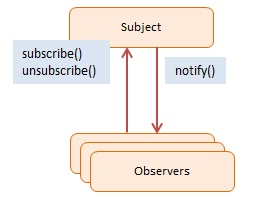

# JavaScript Observer Pattern

> **Observer Pattern** (Publish-Subscribe) thiết lập một mối quan hệ một-nhiều (one-to-many) giữa các object. Khi một object (Subject/Publisher) thay đổi trạng thái, nó sẽ tự động thông báo cho tất cả các object đang đăng ký theo dõi nó (Observers/Subscribers).

Mô hình này là lõi (core foundation) của lập trình hướng sự kiện (Event-Driven Programming), bao gồm cả hệ thống sự kiện DOM trên trình duyệt HTML/JS và thư viện nổi tiếng như RxJS.

## 1. Using Observer (Khi nào dùng)
- **Hệ thống phi tập trung (Decoupled)**: Khi bạn có 1 sự thay đổi ở Component A, và muốn Component B, Component C tự động phản ứng lại mà không cần A phải "cứng nhắc" gọi đích danh hàm của B, C.
- UI Frameworks (React, Vue) và State Managements (Redux, Pinia, Vuex) phần lớn hoạt động dựa trên triết lý cốt lõi của Observer để re-render view ngay khi state đổi.

## 2. Implementation Ways

### Cách 1: ES5 Prototype - [dofactory.js](./dofactory.js)
Ví dụ kinh điển: Tạo mảng `this.listeners = []` trong Subject. Các thành phần khác gọi hàm `clickEvent.subscribe(handler)` để thêm tên hàm của mình vào mảng đó. Khi Subject cần bắn event, nó đơn giản là duyệt mảng `listeners.forEach(...)` và gọi các hàm đó.

### Cách 2: ES6 Class - [es6-class.js](./es6-class.js)
Sử dụng ES6 Classes mang lại cách gói gọn cấu trúc tốt hơn trong OOP. Ta có Class `Observer` với method `.update()`, và Class `Subject` chứa `observerList` cùng các method `addObserver()` và `notify()`.

```js
const subject = new Subject();
const riki = new Observer("Riki"); // Observer A
const sniper = new Observer("Sniper"); // Observer B

// Ghi danh theo dõi
subject.addObserver(riki); 
subject.addObserver(sniper);

// Bắn sự kiện 1 lần, tất cả observer đều bắt được
subject.notify({ long: 123, lat: 106 });
```

## 3. Pros & Cons

### ✅ Advantages (Ưu điểm)
- **Loose Coupling**: Subject chỉ cần cung cấp interface đăng ký (subscribe/unsubscribe), không cần biết gì về code bên trong của Observer.
- **Dynamic Relationships**: Thêm bớt số lượng Observer vào thời gian chạy (runtime) vô cùng linh hoạt.

### ❌ Disadvantages (Nhược điểm)
- **Memory Leaks**: Đây là lỗi KHÉT TIẾNG NHẤT của pattern này (thường gọi là Lapsed Listener Problem). Nếu Observer bị phá huỷ (Destroy) nhưng quên gọi hàm `unsubscribe()`, con trỏ trong mảng của Subject vẫn tiếp tục giữ nó lại trên memory, gây tràn RAM và lỗi logic ngầm.

## 4. Diagram



## 5. Participants
- **Subject** (`Subject`, `ClickSubject`): Lưu giữ danh sách các `Observers` và lộ ra các method `subscribe()`, `unsubscribe()`, `notify()`.
- **Observers** (`Observer`, `clickHandler`): Các object có hàm `.update()` (hoặc chính nó là Function) được thiết kế để đón lấy Data Payload từ Subject bắn tới.