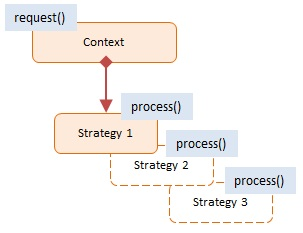

# JavaScript Strategy Pattern

> **Strategy Pattern** (Mẫu chiến lược) đóng gói một họ (family) các thuật toán/hành vi có chung mục đích vào bên trong các lớp riêng biệt. Điều này cho phép client lựa chọn chiến lược phù hợp vào thời gian chạy (runtime) và làm cho các thuật toán có thể **thay thế cho nhau** mà không vi phạm cấu trúc tĩnh cũ.

Nói một cách đơn giản: Thay vì dùng 1 đống lệnh `if...else if` khổng lồ trong 1 hàm duy nhất, chúng ta tách mỗi khối `if` thành 1 hàm (hoặc 1 object/class) xử lý độc lập.

## 1. Using Strategy (Khi nào dùng)
- **Thay thế cho mớ hỗn độn 100 dòng If-Else**: Mọi khối điều kiện rắc rối trong một hàm (ví dụ code tính khuyến mãi ngày Tết, Quốc khánh, Black Friday, No-sale) nên được uỷ quyền (delegate) về cho các "chiến lược" xử lý tương ứng.
- **Tuân thủ quy tắc Đóng/Mở (Open/Closed)**: Bạn có thể thêm hàng trăm chương trình khuyến mãi/phương thức thanh toán mới mà tuyệt đối **không được sửa** vào hàm tính tiền / object Checkout hiện tại. Tránh nguy cơ làm hỏng logic hiện đang chạy tốt.

## 2. Implementation Ways

### Cách 0: Anti-pattern - [anti-pattern.js](./anti-pattern.js)
Ví dụ minh hoạ cách code "thông thường". Một hàm chứa nhiều dòng `if`. Vi phạm nghiêm trọng nguyên tắc **Single Responsibility Principle (Trách nhiệm duy nhất)**. Mỗi lần tạo chương trình Sale mới, Dev lại phải chui vào đây sửa logic hàm. 

### Cách 1: ES6 Functional (Bản chất JS) - [es6-functional.js](./es6-functional.js)
Đây là cách code Strategy "Javascript-idiomatic" nhất. Chẳng cần tạo Class lằng nhằng, chúng ta tận dụng Object Literal Map.
- Map một key là Enum/Tên gói chiến lược, Value là hàm của nó.
- Truy xuất hằng số thời gian `O(1)`: `strategies[strategyName](...)`. Rất gọn gàng và hiệu suất cao.

### Cách 2: ES6 Object-Oriented - [es6-class.js](./es6-class.js)
Cách code chuẩn OOP Gang of Four.
Phù hợp với các hệ thống đồ sộ như API xử lý thanh toán (CreditCard, Paypal). Các chiến lược giờ đây là các Class chứa nhiều logic phức tạp, state riêng và triển khai một Interface (hàm `pay(amount)`). 
- Context (`ShoppingCart`) chỉ cần nhận abstract strategy từ bên ngoài truyền vào thông qua Dependency Injection. ShoppingCart vô tư `checkout()` mà không cần quan tâm user đang xài ví điện tử nào.

## 3. Pros & Cons

### ✅ Advantages (Ưu điểm)
- **Tránh Code Bẩn**: Sạch bóng Code if-else / switch-case.
- **Tăng tính tái sử dụng**: Bất kỳ chỗ nào cũng có thể cắm 1 chiến lược vào miễn là truyền cùng Interface thay vì copy code logic.
- **Tách riêng sự biến động**: Context không bị phình to (ví dụ ShoppingCart luôn đơn giản bất kể có trăm ngàn ví kết nối).

### ❌ Disadvantages (Nhược điểm)
- **Gia tăng sự phức tạp nhẹ**: Tăng số file/function do mỗi Strategy bóc lẻ ra.
- **Client phải hiểu ý nghĩa chiến lược**: Client (hoặc Router) là đứa gửi Request phải xác định chính xác nó đang cần dùng `Strategy` nào để truyền vào tham số cài đặt.

## 4. Diagram

